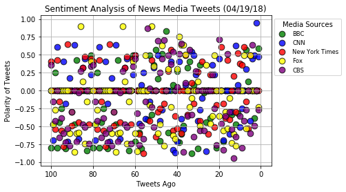
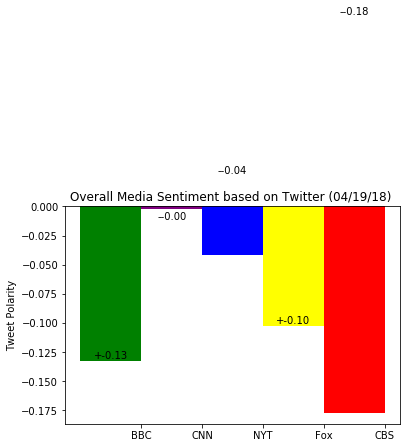

```python
# Dependencies
%matplotlib inline
import numpy as np
import pandas as pd
import matplotlib.pyplot as plt
import json
import tweepy
import csv
import time
import seaborn as sns

# Sentiment Analysis
from textblob import TextBlob
from vaderSentiment.vaderSentiment import SentimentIntensityAnalyzer
analyzer = SentimentIntensityAnalyzer()

# Twitter API Keys
consumer_key = "ae7R1aGdXEsC33OGlGF22f3Zs"
consumer_secret = "jxHdLEeGVGGjY08hoDcSF5P70sKmnO09Lh537wsa6jOrmKA0Lv"
access_token = "413505097-lGcpBoa1LnkdmtcNqmfPeWHBWwgnLIyu5sSLgRdW"
access_token_secret = "Dt9Sx3mKeacKoSbs3TsenClNRf4aGahXiqum5w3dOP2Vl"
```


```python
# Authentication of Tweepy API
auth = tweepy.OAuthHandler(consumer_key, consumer_secret)
auth.set_access_token(access_token, access_token_secret)
api = tweepy.API(auth, parser=tweepy.parsers.JSONParser())

# News Media Twitter Accounts
news_source = ["BBCWorld", "CNN", "nytimes", "FoxNews", "CBSNews"]
```


```python
# Dictionary for Tweet Data
tweet_data = {
    "tweet_source": [],
    "tweet_text": [],
    "tweet_date": [],
    "tweet_vader_score": [],
    "tweet_neg_score": [],
    "tweet_pos_score": [],
    "tweet_neu_score": []
}

for x in range(5):

    # Loop news sources
    for source in news_source:

        tweets = api.user_timeline(source, page=x)

        for tweet in tweets:

            # JSON Data Grab from Twitter
            tweet_data["tweet_source"].append(tweet["user"]["name"])
            tweet_data["tweet_text"].append(tweet["text"])
            tweet_data["tweet_date"].append(tweet["created_at"])

            # Vader Sentiment Analysis
            tweet_data["tweet_vader_score"].append(analyzer.polarity_scores(tweet["text"])["compound"])
            tweet_data["tweet_pos_score"].append(analyzer.polarity_scores(tweet["text"])["pos"])
            tweet_data["tweet_neu_score"].append(analyzer.polarity_scores(tweet["text"])["neu"])
            tweet_data["tweet_neg_score"].append(analyzer.polarity_scores(tweet["text"])["neg"])
            
# Store the final contents into a DataFrame
tweet_df = pd.DataFrame(tweet_data, columns=["tweet_source", 
                                             "tweet_text", 
                                             "tweet_date",
                                             "tweet_vader_score",
                                             "tweet_pos_score",
                                             "tweet_neu_score",
                                             "tweet_neg_score"])

# Export to CSV
file_name = str(time.strftime("%m-%d-%y")) + "-tweets.csv"
tweet_df.to_csv("Homework_Assignments/Homework7_Social_Analytics/" + file_name, encoding="utf-8")

# Visualize the DataFrame
tweet_df.head()
```


    ---------------------------------------------------------------------------

    FileNotFoundError                         Traceback (most recent call last)

    <ipython-input-33-47e36788633a> in <module>()
         41 # Export to CSV
         42 file_name = str(time.strftime("%m-%d-%y")) + "-tweets.csv"
    ---> 43 tweet_df.to_csv("Homework_Assignments/Homework7_Social_Analytics/" + file_name, encoding="utf-8")
         44 
         45 # Visualize the DataFrame


    ~/anaconda3/envs/PythonData/lib/python3.6/site-packages/pandas/core/frame.py in to_csv(self, path_or_buf, sep, na_rep, float_format, columns, header, index, index_label, mode, encoding, compression, quoting, quotechar, line_terminator, chunksize, tupleize_cols, date_format, doublequote, escapechar, decimal)
       1522                                      doublequote=doublequote,
       1523                                      escapechar=escapechar, decimal=decimal)
    -> 1524         formatter.save()
       1525 
       1526         if path_or_buf is None:


    ~/anaconda3/envs/PythonData/lib/python3.6/site-packages/pandas/io/formats/format.py in save(self)
       1635             f, handles = _get_handle(self.path_or_buf, self.mode,
       1636                                      encoding=encoding,
    -> 1637                                      compression=self.compression)
       1638             close = True
       1639 


    ~/anaconda3/envs/PythonData/lib/python3.6/site-packages/pandas/io/common.py in _get_handle(path_or_buf, mode, encoding, compression, memory_map, is_text)
        388         elif encoding:
        389             # Python 3 and encoding
    --> 390             f = open(path_or_buf, mode, encoding=encoding)
        391         elif is_text:
        392             # Python 3 and no explicit encoding


    FileNotFoundError: [Errno 2] No such file or directory: 'Homework_Assignments/Homework7_Social_Analytics/04-19-18-tweets.csv'


```python
# Count the total number of tweets
tweet_df.count()
```


    tweet_source         500
    tweet_text           500
    tweet_date           500
    tweet_vader_score    500
    tweet_pos_score      500
    tweet_neu_score      500
    tweet_neg_score      500
    dtype: int64


```python
# Source Names
tweet_df["tweet_source"].unique()
```


    array(['BBC News (World)', 'CNN', 'The New York Times', 'Fox News',
           'CBS News'], dtype=object)


```python
# Convert dates into datetimes
tweet_df["tweet_date"] = pd.to_datetime(tweet_df["tweet_date"])

# Sort the dataframe by date
tweet_df.sort_values("tweet_date", inplace=True)
tweet_df.reset_index(drop=True, inplace=True)

tweet_df.head()
```


<div>
<style scoped>
    .dataframe tbody tr th:only-of-type {
        vertical-align: middle;
    }

    .dataframe tbody tr th {
        vertical-align: top;
    }

    .dataframe thead th {
        text-align: right;
    }
</style>
<table border="1" class="dataframe">
  <thead>
    <tr style="text-align: right;">
      <th></th>
      <th>tweet_source</th>
      <th>tweet_text</th>
      <th>tweet_date</th>
      <th>tweet_vader_score</th>
      <th>tweet_pos_score</th>
      <th>tweet_neu_score</th>
      <th>tweet_neg_score</th>
    </tr>
  </thead>
  <tbody>
    <tr>
      <th>0</th>
      <td>BBC News (World)</td>
      <td>Southwest crash: Passengers praise pilot for s...</td>
      <td>2018-04-18 15:28:22</td>
      <td>0.5859</td>
      <td>0.428</td>
      <td>0.395</td>
      <td>0.178</td>
    </tr>
    <tr>
      <th>1</th>
      <td>BBC News (World)</td>
      <td>London mayor: Justin Trudeau and Jacinda Arder...</td>
      <td>2018-04-18 15:36:42</td>
      <td>0.0000</td>
      <td>0.000</td>
      <td>1.000</td>
      <td>0.000</td>
    </tr>
    <tr>
      <th>2</th>
      <td>BBC News (World)</td>
      <td>Belgium firms prosecuted over exporting Sarin ...</td>
      <td>2018-04-18 15:47:19</td>
      <td>-0.3818</td>
      <td>0.000</td>
      <td>0.776</td>
      <td>0.224</td>
    </tr>
    <tr>
      <th>3</th>
      <td>BBC News (World)</td>
      <td>Autistic teen's Lego Titanic replica on displa...</td>
      <td>2018-04-18 16:27:09</td>
      <td>0.0000</td>
      <td>0.000</td>
      <td>1.000</td>
      <td>0.000</td>
    </tr>
    <tr>
      <th>4</th>
      <td>BBC News (World)</td>
      <td>Cuba nominates Castro replacement https://t.co...</td>
      <td>2018-04-18 16:27:09</td>
      <td>0.0000</td>
      <td>0.000</td>
      <td>1.000</td>
      <td>0.000</td>
    </tr>
  </tbody>
</table>
</div>


```python
# Scatter Plot
plt.scatter(np.arange(-len(tweet_df[tweet_df["tweet_source"] == "BBC News (World)"]), 0, 1), 
            tweet_df[tweet_df["tweet_source"] == "BBC News (World)"]["tweet_vader_score"],
            edgecolor="black", linewidths=1, marker="o", color="green", s=75,
            alpha=0.8, label="BBC")

plt.scatter(np.arange(-len(tweet_df[tweet_df["tweet_source"] == "CNN"]), 0, 1), 
            tweet_df[tweet_df["tweet_source"] == "CNN"]["tweet_vader_score"],
            edgecolor="black", linewidths=1, marker="o", color="blue", s=75,
            alpha=0.8, label="CNN")

plt.scatter(np.arange(-len(tweet_df[tweet_df["tweet_source"] == "The New York Times"]), 0, 1), 
            tweet_df[tweet_df["tweet_source"] == "The New York Times"]["tweet_vader_score"],
            edgecolor="black", linewidths=1, marker="o", color="red", s=75,
            alpha=0.8, label="New York Times")

plt.scatter(np.arange(-len(tweet_df[tweet_df["tweet_source"] == "Fox News"]), 0, 1), 
            tweet_df[tweet_df["tweet_source"] == "Fox News"]["tweet_vader_score"],
            edgecolor="black", linewidths=1, marker="o", color="yellow", s=75,
            alpha=0.8, label="Fox")

plt.scatter(np.arange(-len(tweet_df[tweet_df["tweet_source"] == "CBS News"]), 0, 1), 
            tweet_df[tweet_df["tweet_source"] == "CBS News"]["tweet_vader_score"],
            edgecolor="black", linewidths=1, marker="o", color="purple", s=75,
            alpha=0.8, label="CBS")


# Incorporate the other graph properties
plt.title("Sentiment Analysis of News Media Tweets (%s)" % time.strftime("%x"))
plt.ylabel("Polarity of Tweets")
plt.xlabel("Tweets Ago")
plt.xlim([-105, 5])
plt.xticks([-100, -80, -60, -40, -20, 0], [100, 80, 60, 40, 20, 0])
plt.ylim([-1.05, 1.05])
plt.grid(True)

# Create a Legend
lgnd = plt.legend(fontsize="small", mode="Expanded", 
                  numpoints=1, scatterpoints=1, 
                  loc="upper left", bbox_to_anchor=(1,1), title="Media Sources", 
                  labelspacing=0.5)

# Save Figure
file_name = str(time.strftime("%m-%d-%y")) + "-Fig1.png"
plt.savefig("Homework_Assignments/Homework7_Social_Analytics/" + file_name, bbox_extra_artists=(lgnd, ), bbox_inches='tight')

# Show Plot
plt.show()
```


    ---------------------------------------------------------------------------

    FileNotFoundError                         Traceback (most recent call last)

    <ipython-input-36-cda03b51863e> in <module>()
         43 # Save Figure
         44 file_name = str(time.strftime("%m-%d-%y")) + "-Fig1.png"
    ---> 45 plt.savefig("Homework_Assignments/Homework7_Social_Analytics/" + file_name, bbox_extra_artists=(lgnd, ), bbox_inches='tight')
         46 
         47 # Show Plot


    ~/anaconda3/envs/PythonData/lib/python3.6/site-packages/matplotlib/pyplot.py in savefig(*args, **kwargs)
        699 def savefig(*args, **kwargs):
        700     fig = gcf()
    --> 701     res = fig.savefig(*args, **kwargs)
        702     fig.canvas.draw_idle()   # need this if 'transparent=True' to reset colors
        703     return res


    ~/anaconda3/envs/PythonData/lib/python3.6/site-packages/matplotlib/figure.py in savefig(self, fname, **kwargs)
       1832             self.set_frameon(frameon)
       1833 
    -> 1834         self.canvas.print_figure(fname, **kwargs)
       1835 
       1836         if frameon:


    ~/anaconda3/envs/PythonData/lib/python3.6/site-packages/matplotlib/backend_bases.py in print_figure(self, filename, dpi, facecolor, edgecolor, orientation, format, **kwargs)
       2265                 orientation=orientation,
       2266                 bbox_inches_restore=_bbox_inches_restore,
    -> 2267                 **kwargs)
       2268         finally:
       2269             if bbox_inches and restore_bbox:


    ~/anaconda3/envs/PythonData/lib/python3.6/site-packages/matplotlib/backends/backend_agg.py in print_png(self, filename_or_obj, *args, **kwargs)
        510         renderer.dpi = self.figure.dpi
        511         if isinstance(filename_or_obj, six.string_types):
    --> 512             filename_or_obj = open(filename_or_obj, 'wb')
        513             close = True
        514         else:


    FileNotFoundError: [Errno 2] No such file or directory: 'Homework_Assignments/Homework7_Social_Analytics/04-19-18-Fig1.png'





```python
# Average polarity by News Source
tweet_df_polarity = tweet_df.groupby(["tweet_source"]).mean()["tweet_vader_score"]

# View Polarities
pd.DataFrame(tweet_df_polarity)
```


<div>
<style scoped>
    .dataframe tbody tr th:only-of-type {
        vertical-align: middle;
    }

    .dataframe tbody tr th {
        vertical-align: top;
    }

    .dataframe thead th {
        text-align: right;
    }
</style>
<table border="1" class="dataframe">
  <thead>
    <tr style="text-align: right;">
      <th></th>
      <th>tweet_vader_score</th>
    </tr>
    <tr>
      <th>tweet_source</th>
      <th></th>
    </tr>
  </thead>
  <tbody>
    <tr>
      <th>BBC News (World)</th>
      <td>-0.132527</td>
    </tr>
    <tr>
      <th>CBS News</th>
      <td>-0.177613</td>
    </tr>
    <tr>
      <th>CNN</th>
      <td>-0.001964</td>
    </tr>
    <tr>
      <th>Fox News</th>
      <td>-0.102378</td>
    </tr>
    <tr>
      <th>The New York Times</th>
      <td>-0.041554</td>
    </tr>
  </tbody>
</table>
</div>


```python
# Polarity Tuple Storage
tweets_polarity = (tweet_df_polarity["BBC News (World)"], 
                    tweet_df_polarity["CNN"], 
                    tweet_df_polarity["The New York Times"], 
                    tweet_df_polarity["Fox News"],
                    tweet_df_polarity["CBS News"])

# Generate bars for each news source
fig, ax = plt.subplots()
ind = np.arange(len(tweets_polarity))  
width = 1
rect1 = ax.bar(ind[0], tweets_polarity[0], width, color="green")
rect2 = ax.bar(ind[1], tweets_polarity[1], width, color="purple")
rect3 = ax.bar(ind[2], tweets_polarity[2], width, color="blue")
rect4 = ax.bar(ind[3], tweets_polarity[3], width, color='yellow')
rect5 = ax.bar(ind[4], tweets_polarity[4], width, color='red')

# Generate labels for each news source
def autolabelpos(rects):
    for rect in rects:
        height = rect.get_height()
        ax.text(rect.get_x() + rect.get_width()/2., 1*height,
                '+%.2f' % float(height),
                ha='center', va='bottom')

def autolabelneg(rects):
    for rect in rects:
        height = rect.get_height()
        ax.text(rect.get_x() + rect.get_width()/2., -1*height-0.015,
                '-%.2f' % float(height),
                ha='center', va='bottom')

autolabelpos(rect1)
autolabelneg(rect2)
autolabelneg(rect3)
autolabelpos(rect4)
autolabelneg(rect5)

ax.set_ylabel("Tweet Polarity")
ax.set_title("Overall Media Sentiment based on Twitter (%s) " % (time.strftime("%x")))
ax.set_xticks(ind + 0.5)
ax.set_xticklabels(("BBC", "CNN", "NYT", "Fox", "CBS"))
ax.set_autoscaley_on(True)
ax.grid(False)

# Save Figure
file_name = str(time.strftime("%m-%d-%y")) + "-Fig2.png"
plt.savefig("Homework_Assignments/Homework7_Social_Analytics/" + file_name, bbox_extra_artists=(lgnd, ), bbox_inches='tight')

# Show Figure
fig.show()
```


    ---------------------------------------------------------------------------

    FileNotFoundError                         Traceback (most recent call last)

    <ipython-input-38-f73752ce5b9d> in <module>()
         46 # Save Figure
         47 file_name = str(time.strftime("%m-%d-%y")) + "-Fig2.png"
    ---> 48 plt.savefig("Homework_Assignments/Homework7_Social_Analytics/" + file_name, bbox_extra_artists=(lgnd, ), bbox_inches='tight')
         49 
         50 # Show Figure


    ~/anaconda3/envs/PythonData/lib/python3.6/site-packages/matplotlib/pyplot.py in savefig(*args, **kwargs)
        699 def savefig(*args, **kwargs):
        700     fig = gcf()
    --> 701     res = fig.savefig(*args, **kwargs)
        702     fig.canvas.draw_idle()   # need this if 'transparent=True' to reset colors
        703     return res


    ~/anaconda3/envs/PythonData/lib/python3.6/site-packages/matplotlib/figure.py in savefig(self, fname, **kwargs)
       1832             self.set_frameon(frameon)
       1833 
    -> 1834         self.canvas.print_figure(fname, **kwargs)
       1835 
       1836         if frameon:


    ~/anaconda3/envs/PythonData/lib/python3.6/site-packages/matplotlib/backend_bases.py in print_figure(self, filename, dpi, facecolor, edgecolor, orientation, format, **kwargs)
       2265                 orientation=orientation,
       2266                 bbox_inches_restore=_bbox_inches_restore,
    -> 2267                 **kwargs)
       2268         finally:
       2269             if bbox_inches and restore_bbox:


    ~/anaconda3/envs/PythonData/lib/python3.6/site-packages/matplotlib/backends/backend_agg.py in print_png(self, filename_or_obj, *args, **kwargs)
        510         renderer.dpi = self.figure.dpi
        511         if isinstance(filename_or_obj, six.string_types):
    --> 512             filename_or_obj = open(filename_or_obj, 'wb')
        513             close = True
        514         else:


    FileNotFoundError: [Errno 2] No such file or directory: 'Homework_Assignments/Homework7_Social_Analytics/04-19-18-Fig2.png'




